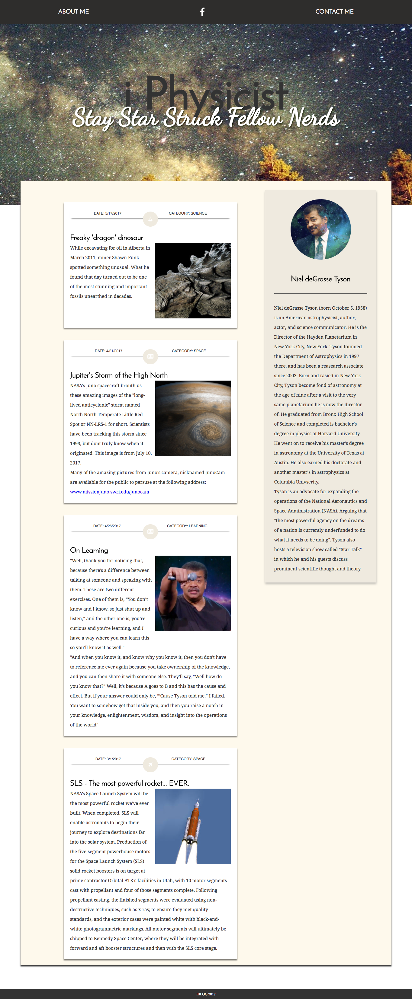

from: https://newline.theironyard.com/cohorts/15/courses/9/projects/40

## Description
Neil deGrasse Tyson, the super smart astrophysicist guy, needs someone to help him finish the styling of his 'i Physicist' blog. He has provided you with a mockup, the complete HTML, and a partially complete CSS file. Your job is to finish the layout and match the visual styles of the mockup with CSS. To match the 'blog' mockup, you will need to use the following:

Positioning
Flexbox
Floating
## Instructions
1. Download and unpack the starter files
2. Review the mockup and the HTML file to see which HTML elements correspond to visual content in the mockup
3. Review the CSS file. It already has a number of styles, so familiarize yourself with what has already been done and what is left to do.
4. Read all of the TODOs in the CSS file before you begin. Some of the TODOs are layout related and some are general styling related.
5. Complete all of the TODOs
## Fonts
For this project we are using the 'Google fonts' API. We have already imported the fonts for you (see head). The fonts are:

* 'Josefin Sans'
* 'Noto Serif'
* 'Dancing Script'
Learn more about the [Google fonts API](https://fonts.google.com/?selection.family=Dancing+Script%7CJosefin+Sans%7CNoto+Serif)

## Hints
* The width of the mockup is 1000px.
* Use flexbox for page layout
* Some elements are flex containers and some are flex items. Remember, flex items are the children of flex containers.
* Measurements don't have to be exact. The site is 1000px wide. You can "guesstimate" the widths and heights so that they visually match the design. This doesn't have to be "pixel perfect".
[Source File](https://tiy-learn-content.s3.amazonaws.com/830262dc-iphys-starter-file.zip)

